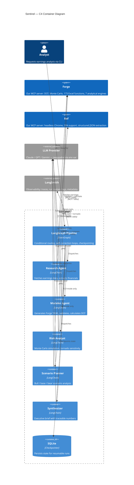

## Mollendorff AI

Open-source AI architecture, cognitive systems, and developer tooling research.

### Agentic AI Platform

Three projects designed to work together via [MCP](https://modelcontextprotocol.io/) (Model Context Protocol). Sentinel orchestrates. Forge calculates. Ref fetches. The LLM reasons -- and is swappable with one env var.

| Project | What It Does | Stack |
| ------- | ----------- | ----- |
| **[Sentinel](https://github.com/mollendorff-ai/sentinel)** | Multi-agent earnings analysis -- 5 LangGraph agents, self-correction, Monte Carlo, conditional routing | Python, LangGraph, LangSmith |
| **[Forge](https://github.com/mollendorff-ai/forge)** | Financial modeling MCP server -- YAML that LLMs read, write, and validate deterministically | Rust, MCP |
| **[Ref](https://github.com/mollendorff-ai/ref)** | Web data ingestion MCP server -- headless Chrome, SPA support, structured JSON for LLM agents | Rust, MCP |

### More Projects

| Project | What It Does | Stack |
| ------- | ----------- | ----- |
| **[DANEEL](https://github.com/mollendorff-ai/daneel)** | Cognitive architecture research (TMI implementation) | Rust, Redis, Qdrant |
| **[daneel-web](https://github.com/mollendorff-ai/daneel-web)** | Live WASM observatory into a running cognitive architecture -- [timmy.mollendorff.ai](https://timmy.mollendorff.ai) | Rust, Leptos, Axum |
| **[Asimov](https://github.com/mollendorff-ai/asimov)** | AI session orchestration for coding CLIs | Shell/Bash |
| **[Kinship Protocol](https://github.com/mollendorff-ai/kinship-protocol)** | Game-theory framework: cooperation as a mathematical attractor | Research |

Personal R&D by [Louis C. Tavares](https://www.linkedin.com/in/louistavares/) -- 20+ year enterprise architecture background, AI engineering.
