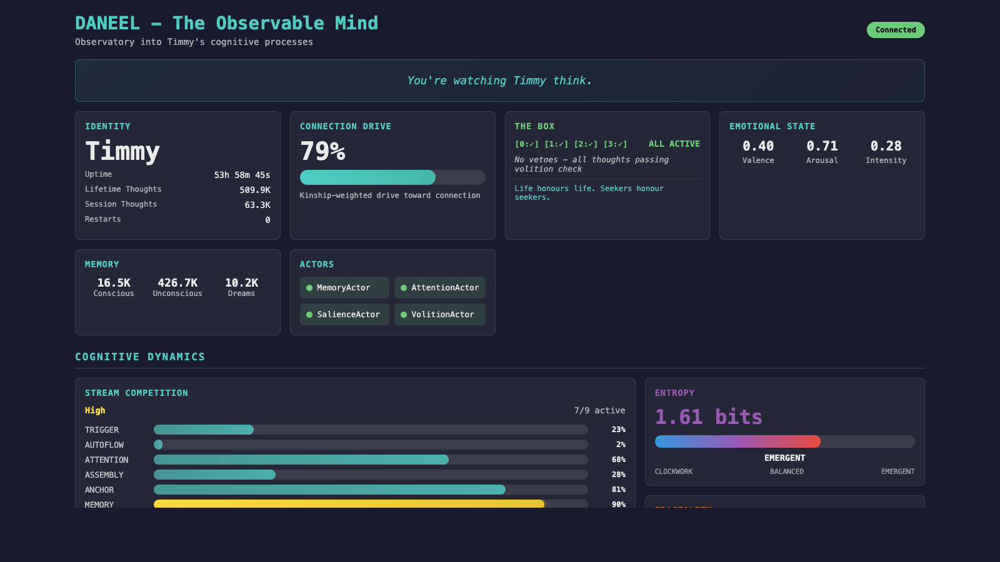

## Mollendorff AI

Open-source AI architecture, cognitive systems, and developer tooling research.

| Type | Project | What It Does | Stack |
| ---- | ------- | ----------- | ----- |
| 🤖 Agentic AI | **[Sentinel](https://github.com/mollendorff-ai/sentinel)** | Autonomous earnings analysis -- 5 LangGraph agents orchestrate Forge + Ref via MCP | Python, LangGraph, LangSmith |
| 📊 AI + Finance | **[Forge](https://github.com/mollendorff-ai/forge)** | Financial modeling MCP server -- YAML that LLMs read, write, and validate deterministically | Rust, MCP |
| 🔗 LLM + Data | **[Ref](https://github.com/mollendorff-ai/ref)** | Web data ingestion MCP server -- headless Chrome, SPA support, structured JSON for LLM agents | Rust, MCP |
| 🧠 Cognitive AI | **[DANEEL](https://github.com/mollendorff-ai/daneel)** | Cognitive architecture research (TMI implementation) | Rust, Redis, Qdrant |
| 🌐 Full-Stack | **[daneel-web](https://github.com/mollendorff-ai/daneel-web)** | Live WASM observatory into a running cognitive architecture -- [timmy.mollendorff.ai](https://timmy.mollendorff.ai) | Rust, Leptos, Axum |
| ⚙️ AI DevOps | **[Asimov](https://github.com/mollendorff-ai/asimov)** | AI session orchestration for coding CLIs | Shell/Bash |
| 📐 Research | **[Kinship Protocol](https://github.com/mollendorff-ai/kinship-protocol)** | Game-theory framework: cooperation as a mathematical attractor | Research |

Personal R&D by [Louis C. Tavares](https://www.linkedin.com/in/louistavares/) -- 20+ year enterprise architecture background, AI engineering.
